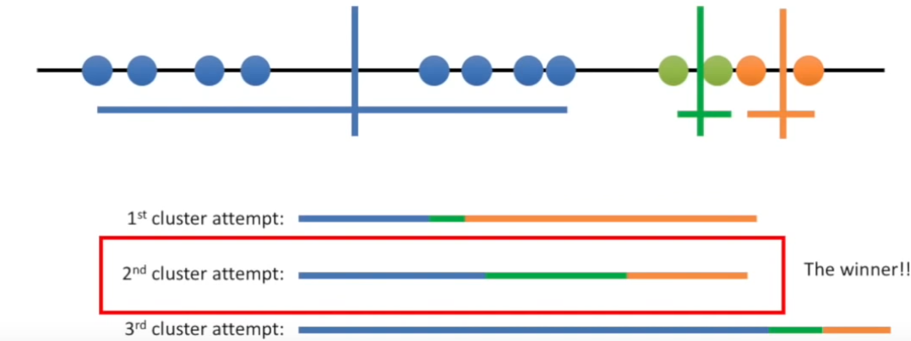

# kMeansClustering
Clusters data points using K-Means Clustering algorithm implemented in C++

K-Means Clustering is a simple unsupervised machine learning model. It will cluster data points
based on how similar they are in relation to some distinct predicate.

A data points categorical similarity is computed solely 
based on its distance from all k data points.

Initially the starter data points are randomly selected, 
then the mean is used to computer the next compare points.

After a globally distinguished number of iterations, 
you can simply fetch the best Clustering based on those 
with the lowest total variance.

### Example of total variance with k = 3:

### Visual Representation:

## Resources: 
https://youtu.be/4b5d3muPQmA